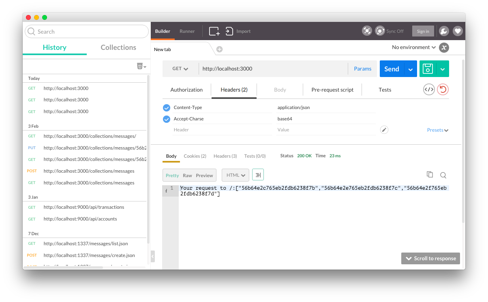

# Setting http Headers

## Objectives

1. Describe how to read request headers
2. Describe how to write response headers
1. Refresh knowledge about Content-Type header
1. Refresh knowledge about Content-Length header


## Overview

Most of web developers are familiar with HTTP headers. They are part of the HTTP requests and responses. Simply put, they provide meta information about the request or response such as content type, content length, language, etc. Without headers, clients including browsers, will be clueless on what the content in the body of the response to expect. They need this meta data to render the content more intelligently. Similarly, without headers, servers will be left guessing what is the nature of the request and what is expected of the server in terms of the response. 

For example, if we have the type of the content as plain text but really it's an HTML code that we want to browsers to render, some browsers might just output HTML code instead of the web page. Not the result we want!

Headers often contain authentication information as well. This enables user sessions.

This lesson will cover how to read any the request headers and write any response headers on the server using the examples of Accept-Charset, and Content-Type, Content-Length headers.

## Request Headers

`request` object of the request handler has an object `headers`. It has names of the headers as keys/properties. The names are lower-cased. For example, if you want to get the value of the `Accept-Charset` request header, you can access `request.headers['accept-charset']`:

```js
console.log(request.headers['accept-charset'])
```

Note: If you don't know what Accept-Charset is, it's the value of the character set which client tells the server it (client) accepts as response. According to [Mozilla Developer Network](https://developer.mozilla.org/en-US/docs/Web/HTTP/Content_negotiation#The_Accept-Charset_header), Accept-Charset is lists the character sets supported by the user agent. Example values are `utf-8`, `ISO-8859-1`.

To send the request headers, we like to use curl, because it's a simplistic CLI tool with straightforward options. You can use CURL on any server! We really advice against using Postman because it requires GUI (graphical environment) and adds additional complexity. Try using Postman on your Ubuntu AWS instance. So if you want to become a real developer—use CURL.

CURL is easy. For example, to get the <http://webapplog.com/about/> page, you can run this command in your terminal (GET request):

```
curl http://webapplog.com/about/
```

If you need to send POST request, you can specify `--data` or `-d` option along with `-X POST` options:

```
curl -X POST -d "ke1=value1" http://webapplog.com/about/
```

To send headers, use `--header` option:

```
curl --header "Accept-Charset: base64" localhost:3000
```

Note: CURL comes with most POSIX (Unix-like) systems. You can get CURL for Windows [here](http://www.confusedbycode.com/curl).

Note: If you prefer GUI (graphical user interface) over CLI (command-line interface), you can use the [Postman Chrome app](http://www.getpostman.com) to send a request with a custom `Accept-Charset` header along with its Interceptor extension.



Request headers can be arbitrary like "Azat-Header".  So this code will work as well: 

```
console.log(request.headers['azat-header'])
```


```
curl --header "Azat-Header: base64" localhost:3000
```


## Response Headers

When it comes to sending back the response, it's a good idea to write response headers. As mentioned before, clients will work more intelligently without content when our servers provide proper response headers. For the same reason, we also want to send back the appropriate status code. 

There are four categories of status codes:

* 2XX: for successfully processed requests
* 3XX: for redirections or cache information
* 4XX: for client-side errors
* 5XX: for server-side errors

Using the core `http` module in the request handler, we can write the header with `writeHead()` which has this signature: 

```
response.writeHead(statusCode[, statusMessage][, headers]))
```

In this signature,  `[]` signify optional parameters (not arrays). In other words, statusCode is mandatory and `statusMessage` and `headers` is not. You will see this annotation in all official documentations so get used to it. 

Now let's get back to the headers. `statusMessage` is a string and `headers` is an object. They are optional as noted before by the `[]`. For example, if we want to you send back status 200 with the message okay and two headers `Content-Type` and `Content-Length`, then we can use these statements:


```js
  var body = 'Your request to ' + request.url + ':' + JSON.stringify(users)
  response.writeHead(200, 'awesome', {
    'Content-Length': body.length,
    'Content-Type': 'text/plain' })
  response.end(body)
```

The resulting response will have the message `awesome`. You can see it if you run CURL in the verbose mode with `-v`. The command will print the details of the request and the response including their headers:

```
 $  curl --header "Azat-Header: base64" localhost:3000 -v
* Rebuilt URL to: localhost:3000/
*   Trying 127.0.0.1...
* Connected to localhost (127.0.0.1) port 3000 (#0)
> GET / HTTP/1.1
> Host: localhost:3000
> User-Agent: curl/7.43.0
> Accept: */*
> Azat-Header: base64
>
< HTTP/1.1 200 awesome
< Content-Length: 100
< Content-Type: text/plain
< Date: Sun, 07 Feb 2016 19:34:45 GMT
< Connection: keep-alive
<
* Connection #0 to host localhost left intact
Your request to /:["56b64e2c765eb2fdb6238f7b","56b64e2e765eb2fdb6238f7c","56b64e2f765eb2fdb6238f7d"]%
```


## Applying Code to Request Handler

By now, you've learned how to read and set the headers. Just to make sure you have the clear understanding of where to apply the code, here is an example of an HTTP server which reads and sets the headers:

```js
var http = require('http')

var server = http.createServer(function(request, response) {
  console.log(request.headers['accept-charset'])
  console.log(request.headers['azat-header'])
  console.log('URL: ', request.url)
  console.log('METHOD: ', request.method)
  var users = ['56b64e2c765eb2fdb6238f7b', '56b64e2e765eb2fdb6238f7c', '56b64e2f765eb2fdb6238f7d']
  var body = 'Your request to ' + request.url + ':' + JSON.stringify(users)
  response.writeHead(200, 'awesome', {
    'Content-Length': body.length,
    'Content-Type': 'text/plain' })
  response.end(body)
})

server.listen(3000)
```

The answer as you might have guessed is that we set and write the headers in the request handler which is the callback function to `createServer()`. The code of the request handler will be triggered on each new request. We can write different logic depending on the values of the request headers:

```js
if (request.headers['appect-charset'] == 'base64') {
  // output binary response
} else {
  // output utf8 response
}
```

## Resources

1. [Header Field Definitions specification](https://www.w3.org/Protocols/rfc2616/rfc2616-sec14.html)
1. [List of HTTP header fields](https://en.wikipedia.org/wiki/List_of_HTTP_header_fields)
1. [request headers official documentation](https://nodejs.org/api/http.html#http_message_headers)
1. [writeHead official documentation](https://nodejs.org/api/http.html#http_response_writehead_statuscode_statusmessage_headers)
1. [HTTP - Setting Content-Type header video](https://www.youtube.com/watch?v=P6MHXU2Vu1s)
1. [CURL for Windows](http://www.confusedbycode.com/curl)
1. [Postman Chrome app](http://www.getpostman.com)
1. [Using cURL to automate HTTP jobs](https://curl.haxx.se/docs/httpscripting.html)

---

<a href='https://learn.co/lessons/node-http-headers' data-visibility='hidden'>View this lesson on Learn.co</a>
